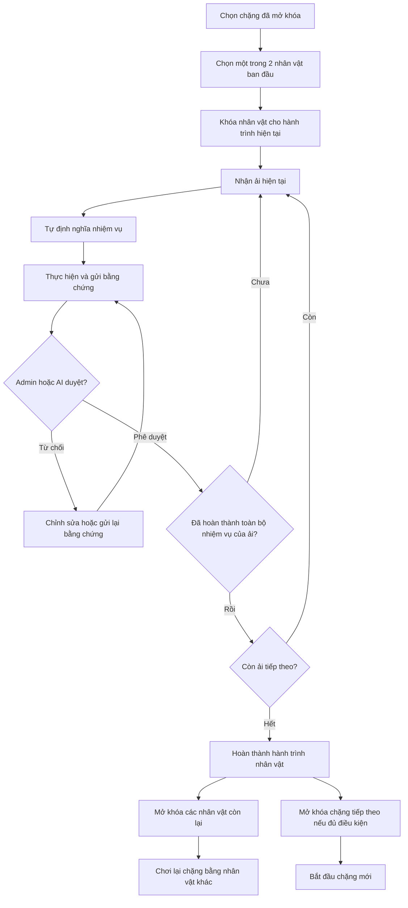
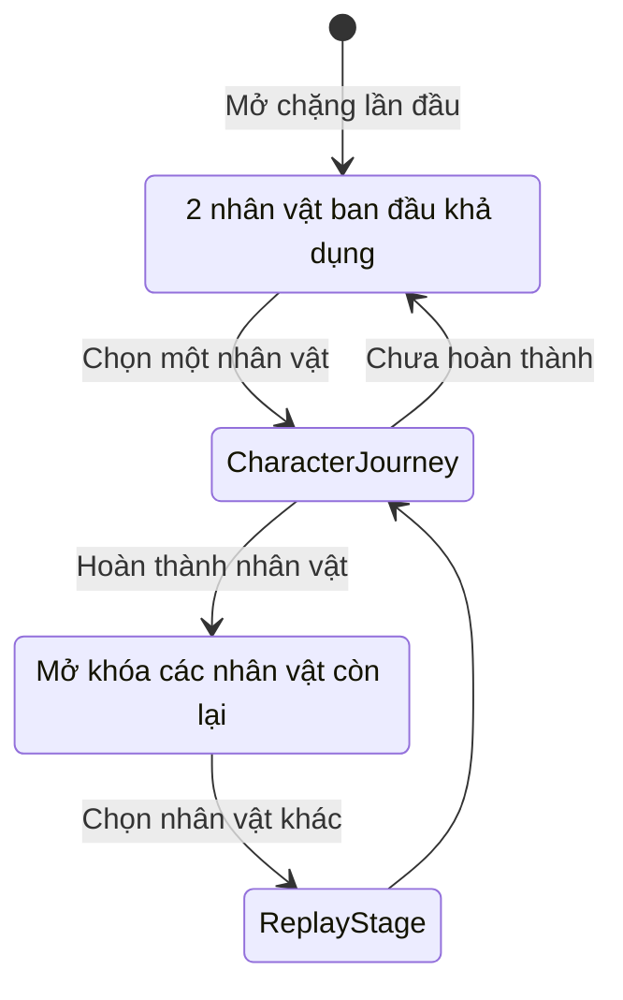

# Thiết kế ứng dụng phát triển bản thân dạng game vượt ải

## 1. Tổng quan

Ứng dụng hỗ trợ người dùng phát triển bản thân thông qua một hành trình được game hóa. Người dùng thực hiện các nhiệm vụ ngoài đời liên quan đến học tập, rèn luyện, xây dựng thói quen và phát triển kỹ năng để vượt qua từng ải.

Bối cảnh của ứng dụng được xây dựng dựa trên các tiểu thuyết kinh điển như:

- Tây Du Ký
- Tam Quốc
- Thủy Hử
- Các tác phẩm khác có thể được bổ sung trong tương lai

Mỗi tiểu thuyết tương ứng với một **chặng lớn**. Người dùng phải hoàn thành một chặng để mở khóa chặng tiếp theo.

## 2. Cấu trúc hành trình

Luồng tổng quát:

1. Người dùng chọn chặng đang được mở khóa.
2. Người dùng chọn một trong các nhân vật đang được mở khóa của chặng đó.
3. Hệ thống tạo hành trình riêng theo nhân vật đã chọn.
4. Người dùng lần lượt vượt qua các ải của nhân vật.
5. Mỗi ải yêu cầu hoàn thành một hoặc nhiều nhiệm vụ ngoài đời.
6. Người dùng gửi bằng chứng sau khi thực hiện nhiệm vụ.
7. Admin hoặc AI kiểm tra và duyệt bằng chứng.
8. Khi hoàn thành toàn bộ hành trình, nhân vật được ghi nhận hoàn thành.
9. Hệ thống mở khóa thêm nhân vật trong chặng và mở chặng tiếp theo nếu đủ điều kiện.

### Sơ đồ luồng sơ bộ của app/game



Sơ đồ trên mô tả luồng chính. Các điều kiện chi tiết như số nhiệm vụ, số lần gửi lại và cách mở khóa chặng sẽ được bổ sung sau.

## 3. Quy tắc lựa chọn nhân vật

- Khi một chặng được mở lần đầu, chỉ có **2 nhân vật ban đầu** khả dụng.
- Các nhân vật còn lại của chặng ở trạng thái khóa.
- Người dùng phải chọn một trong các nhân vật đang khả dụng để bắt đầu.
- Nhân vật không thể thay đổi trong khi hành trình đang diễn ra.
- Mỗi nhân vật có tuyến ải, chủ đề rèn luyện và tiến trình riêng.
- Người dùng phải hoàn thành toàn bộ hành trình của nhân vật đã chọn.
- Khi hoàn thành một hành trình nhân vật, hệ thống mở khóa thêm các nhân vật còn lại của chặng.
- Sau khi có nhân vật mới được mở khóa, người dùng có thể chơi lại chặng đó bằng nhân vật khác.
- Một nhân vật đã hoàn thành vẫn được lưu trong lịch sử và không bị mất tiến trình.
- Hoàn thành chặng lần đầu sẽ mở khóa chặng tiếp theo.
- Tiến trình và thành tích của từng nhân vật được lưu riêng.

Một lượt chơi bằng một nhân vật được gọi là **Hành trình nhân vật** (`Character Journey`).

### Cơ chế mở khóa nhân vật



> Lưu ý: Nhân vật thuộc về **chặng**; mỗi nhân vật có nhiều **ải** trong hành trình riêng.

## 4. Hệ thống ải và nhiệm vụ

### 4.1. Ải

Ải do hệ thống hoặc admin thiết kế, thể hiện một mục tiêu phát triển cụ thể.

Ví dụ:

> Duy trì kỷ luật học tập trong 7 ngày liên tiếp.

Một ải có thể bao gồm một hoặc nhiều nhiệm vụ. Điều kiện hoàn thành từng ải sẽ được xác định chi tiết trong giai đoạn thiết kế tiếp theo.

### 4.2. Nhiệm vụ

Người dùng có thể tự định nghĩa nhiệm vụ thực tế phù hợp với yêu cầu của ải.

Ví dụ:

- Học tiếng Anh 30 phút mỗi ngày.
- Đọc 10 trang sách mỗi ngày.
- Hoàn thành một bài lập trình.
- Ôn bài trước 21 giờ.
- Thực hành một kỹ năng trong thời gian đã cam kết.

Hệ thống gồm hai tầng:

| Thành phần | Người tạo | Vai trò |
| --- | --- | --- |
| Ải/Thử thách | Hệ thống hoặc admin | Đưa ra mục tiêu phát triển |
| Nhiệm vụ thực tế | Người dùng | Xác định hành động cụ thể để đạt mục tiêu |

Nhiệm vụ do người dùng tạo cần đáp ứng các điều kiện:

- Liên quan đến mục tiêu của ải.
- Có nội dung và kết quả đủ rõ ràng để kiểm tra.
- Có thời hạn hoặc tần suất thực hiện cụ thể.
- Có loại bằng chứng phù hợp.
- Không vi phạm quy định an toàn của ứng dụng.

Trong tương lai, AI có thể hỗ trợ đánh giá nhiệm vụ ngay khi người dùng tạo và đề xuất điều chỉnh nếu nhiệm vụ chưa phù hợp.

## 5. Bằng chứng và quy trình duyệt

Người dùng không thể tự đánh dấu hoàn thành nhiệm vụ mà phải gửi bằng chứng.

Các loại bằng chứng dự kiến:

- Hình ảnh.
- Video ngắn.
- Ảnh chụp màn hình.
- File kết quả.
- Nội dung mô tả hoặc nhật ký check-in.
- Dữ liệu tích hợp từ ứng dụng học tập hoặc rèn luyện khác trong tương lai.

Quy trình xử lý:

1. Người dùng nhận và thực hiện nhiệm vụ.
2. Người dùng gửi bằng chứng.
3. Bài nộp chuyển sang trạng thái chờ duyệt.
4. Admin hoặc AI kiểm tra bằng chứng.
5. Bằng chứng hợp lệ được phê duyệt và nhiệm vụ được ghi nhận hoàn thành.
6. Bằng chứng không hợp lệ bị từ chối kèm lý do.
7. Người dùng có thể bổ sung hoặc gửi lại bằng chứng.

Các trạng thái cơ bản của bài nộp:

- `DOING`: Đang thực hiện.
- `SUBMITTED`: Đã gửi và đang chờ duyệt.
- `APPROVED`: Được phê duyệt.
- `REJECTED`: Bị từ chối và có thể gửi lại.

## 6. Lộ trình kiểm duyệt

### Giai đoạn MVP

- Admin duyệt bằng chứng thủ công.
- Admin có thể phê duyệt hoặc từ chối kèm lý do.
- Hệ thống lưu lịch sử xét duyệt.

### Giai đoạn tích hợp AI

AI có thể hỗ trợ:

- Đối chiếu bằng chứng với yêu cầu nhiệm vụ.
- Phát hiện bằng chứng trùng lặp.
- Đánh giá mức độ liên quan và độ tin cậy.
- Tự động phê duyệt các trường hợp rõ ràng.
- Chuyển các trường hợp không chắc chắn cho admin.

Trong giai đoạn đầu tích hợp, AI không nên là cơ chế duy nhất đưa ra quyết định từ chối. Người dùng cần có cơ chế yêu cầu admin xem xét lại.

## 7. Phần thưởng và mở khóa

Phần thưởng dự kiến có thể bao gồm:

- Điểm kinh nghiệm.
- Cấp độ người dùng.
- Vật phẩm trong game.
- Danh hiệu và huy hiệu.
- Nội dung cốt truyện mới.
- Nâng cấp hoặc trang phục nhân vật.
- Mở khóa nhân vật mới trong chặng hiện tại.
- Mở khóa ải mới.
- Mở khóa chặng tiểu thuyết tiếp theo.

Cơ chế phần thưởng chi tiết sẽ được thiết kế sau để tránh việc người dùng lợi dụng nhiệm vụ quá dễ nhằm nhận thưởng.

## 8. Các thực thể nghiệp vụ chính

| Thực thể | Mô tả |
| --- | --- |
| `Story` / `Novel` | Tiểu thuyết hoặc thế giới của một chặng lớn |
| `Character` | Nhân vật người dùng có thể chọn trong một chặng |
| `CharacterJourney` | Một lượt chơi bằng nhân vật đã chọn |
| `Gate` / `Stage` | Một ải thuộc hành trình nhân vật |
| `UserTask` | Nhiệm vụ thực tế do người dùng tự định nghĩa |
| `Submission` | Bài nộp và bằng chứng hoàn thành nhiệm vụ |
| `Review` | Kết quả duyệt của admin hoặc AI |
| `Reward` | Phần thưởng nhận được sau khi hoàn thành |
| `UnlockProgress` | Trạng thái mở khóa chặng, nhân vật hoặc nội dung |

## 9. Ví dụ định hướng cho chặng Tây Du Ký

Các tuyến nhân vật có thể được định hướng sơ bộ như sau:

| Nhân vật | Chủ đề phát triển dự kiến |
| --- | --- |
| Tôn Ngộ Không | Kỷ luật, hành động, làm chủ khả năng |
| Đường Tăng | Kiên trì, học tập, giữ cam kết |
| Trư Bát Giới | Cải thiện thói quen, hạn chế trì hoãn |
| Sa Tăng | Trách nhiệm, bền bỉ, hỗ trợ tập thể |

Đây mới là định hướng ban đầu, chưa phải nội dung chính thức của từng tuyến ải.

## 10. Các vấn đề cần thiết kế tiếp

- Một ải có bao nhiêu nhiệm vụ?
- Nhiệm vụ được thực hiện một lần, theo ngày hay theo chuỗi liên tục?
- Người dùng có được sửa nhiệm vụ sau khi hành trình bắt đầu không?
- Người dùng có thể bỏ cuộc và bắt đầu lại hành trình không?
- Điều gì xảy ra khi người dùng bỏ lỡ một ngày?
- Một nhiệm vụ được gửi lại bằng chứng tối đa bao nhiêu lần?
- Điều kiện chính xác để hoàn thành ải và mở ải tiếp theo là gì?
- Cách tính điểm kinh nghiệm và phần thưởng.
- Cách chống nhiệm vụ quá dễ hoặc cố tình gian lận.
- Cách bảo vệ quyền riêng tư đối với hình ảnh, video và thông tin cá nhân trong bằng chứng.
- Thiết kế cụ thể cho chặng Tây Du Ký và từng tuyến nhân vật.

## 11. Trạng thái hiện tại

Đã thống nhất:

- Mỗi tiểu thuyết là một chặng lớn.
- Hoàn thành chặng hiện tại để mở khóa chặng tiếp theo.
- Mỗi chặng chỉ mở 2 nhân vật ban đầu.
- Người dùng chọn một trong các nhân vật đã mở khóa và không thể đổi giữa hành trình.
- Hoàn thành một hành trình nhân vật sẽ mở khóa thêm các nhân vật còn lại.
- Sau khi mở khóa nhân vật mới, người dùng có thể chơi lại chặng bằng nhân vật khác.
- Mỗi nhân vật có tuyến ải riêng.
- Người dùng có thể tự định nghĩa nhiệm vụ.
- Hoàn thành nhiệm vụ cần có bằng chứng.
- MVP sử dụng admin duyệt thủ công.
- AI sẽ được tích hợp để hỗ trợ hoặc tự động kiểm duyệt trong tương lai.

## 12. Ghi chú brainstorming và các quyết định mới

Phần này ghi lại các quyết định định hướng đã thống nhất trong quá trình brainstorming. Đây là ghi chú làm việc, chưa phải đặc tả thiết kế cuối cùng.

### 12.1. Định vị sản phẩm

- Ứng dụng cân bằng giữa trải nghiệm game và hiệu quả phát triển bản thân.
- Khi hai yếu tố xung đột, ưu tiên kết quả và cam kết ngoài đời của người dùng.
- Đối tượng ban đầu gồm cả học sinh, sinh viên và người trẻ đi làm.
- Nội dung cốt lõi nên tập trung vào các năng lực chung như kỷ luật, kiên trì, chống trì hoãn và giữ cam kết.
- Sau khoảng 30 ngày, tiêu chí thành công gồm:
  - Người dùng hình thành hoặc cải thiện được ít nhất một thói quen.
  - Người dùng vẫn muốn quay lại tiếp tục hành trình.
  - Người dùng đạt được tiến triển đối với một mục tiêu cụ thể ngoài đời.
- Chỉ số chính nên là tỷ lệ giữ và hoàn thành cam kết; điểm thưởng và số ải hoàn thành là chỉ số hỗ trợ.

### 12.2. Vai trò của nhân vật và cá nhân hóa

- Mỗi nhân vật là một chương trình rèn luyện riêng, có triết lý, tuyến ải và nhịp phát triển khác nhau.
- Khi bắt đầu, người dùng khai báo mục tiêu hoặc vấn đề muốn cải thiện.
- Hệ thống đề xuất một hoặc nhiều nhân vật phù hợp và giải thích lý do.
- Người dùng vẫn được xem và tự chọn trong số các nhân vật đang mở khóa; lựa chọn khác đề xuất không bị phạt.
- Mục tiêu ban đầu được dùng để cá nhân hóa nhiệm vụ thực tế trong tuyến nhân vật đã chọn.

Luồng onboarding định hướng:

1. Người dùng khai báo điều muốn cải thiện.
2. Hệ thống đề xuất nhân vật phù hợp.
3. Người dùng khám phá triết lý và tuyến phát triển của các nhân vật đang mở.
4. Người dùng tự chọn nhân vật.
5. Hệ thống dùng mục tiêu ban đầu để hỗ trợ cá nhân hóa nhiệm vụ trong hành trình.

### 12.3. Phạm vi MVP

- MVP được phát triển dưới dạng ứng dụng mobile.
- Chỉ triển khai thế giới Tây Du Ký.
- Chỉ có hai nhân vật chơi được:
  - Tôn Ngộ Không: hành động, kỷ luật và làm chủ năng lực.
  - Trư Bát Giới: nhận diện cám dỗ, chống trì hoãn và cải thiện thói quen.
- Mỗi nhân vật có một hành trình ngắn đủ để kiểm chứng vòng lặp cốt lõi.
- Đường Tăng, Sa Tăng và các chặng tiếp theo chưa cần chơi được trong MVP; có thể xuất hiện dưới trạng thái khóa hoặc sắp ra mắt.
- AI chưa xuất hiện trong MVP.
- Người dùng chọn nhiệm vụ từ các mẫu rồi chỉnh sửa cho phù hợp.
- Admin vẫn là người quyết định duyệt các bằng chứng quan trọng.
- Hệ thống nên lưu lại những điểm người dùng thường gặp khó để làm dữ liệu xác định vai trò phù hợp của AI trong giai đoạn sau.

### 12.4. Cấu trúc cốt truyện

- Tầm nhìn dài hạn là bám theo các hồi và biến cố quan trọng của nguyên tác, không biến Tây Du Ký thành lớp giao diện trang trí cho một ứng dụng thói quen.
- Không nhất thiết chuyển nguyên xi toàn bộ 81 nạn thành 81 nhiệm vụ.
- Hệ thống chọn các hồi truyện và sự kiện có ý nghĩa đối với quá trình phát triển của từng nhân vật.
- Có một trục cốt truyện chung, kết hợp với chương riêng, ải riêng và cách diễn giải riêng theo góc nhìn từng nhân vật.
- Cùng một biến cố có thể tạo ra bài học khác nhau:
  - Ngộ Không học cách kiểm soát sức mạnh và bớt hành động bốc đồng.
  - Bát Giới học cách không bỏ cuộc khi gặp khó hoặc bị cám dỗ.
- Mỗi nhân vật có một chương nguồn gốc ngắn trước khi hội tụ vào trục thỉnh kinh chung.
- Lựa chọn hội thoại có thể làm thay đổi lời dẫn, phản hồi hoặc cách nhân vật thể hiện thái độ.
- Các lựa chọn không tạo ra nhiều dòng thời gian hoặc kết thúc khác nhau trong MVP; các mốc chính vẫn trở về trục nguyên tác.
- Bản đồ có thể thể hiện hành trình lớn phía trước dù MVP mới chỉ cho chơi một phần mở đầu.

### 12.5. Quan hệ giữa hành trình và mục tiêu ngoài đời

- Khi bắt đầu hành trình, người dùng chọn một lĩnh vực phát triển xuyên suốt như học tập, công việc, sức khỏe hoặc thói quen.
- Nhiệm vụ cụ thể có thể thay đổi qua từng ải nhưng phải liên hệ với lĩnh vực đã chọn và bài học của ải.
- Cách này tạo sự nhất quán mà không bắt người dùng lặp lại một nhiệm vụ duy nhất trong toàn bộ hành trình.

Ví dụ với lĩnh vực học tập:

- Một ải rèn khả năng bắt đầu đúng giờ.
- Một ải rèn khả năng duy trì tập trung.
- Một ải rèn cách quay lại sau ngày mất động lực.
- Một ải yêu cầu hoàn thành một kết quả cụ thể.

### 12.6. Vòng lặp trải nghiệm cốt lõi

Hướng thiết kế được chọn là hành trình cốt truyện dẫn dắt:

```text
Cốt truyện -> Bài học -> Cam kết ngoài đời -> Thực hiện -> Kiểm chứng -> Nhân vật trưởng thành -> Mở cốt truyện mới
```

Luồng dự kiến:

1. Người dùng xem một đoạn cốt truyện.
2. Sự kiện trong truyện đặt ra một bài học hoặc thử thách phát triển bản thân.
3. Người dùng chọn một nhiệm vụ mẫu và điều chỉnh theo hoàn cảnh.
4. Người dùng cam kết thời lượng, tần suất hoặc kết quả cụ thể.
5. Người dùng thực hiện và check-in trong quá trình.
6. Người dùng nộp bằng chứng tại mốc quan trọng.
7. Admin duyệt hoặc từ chối kèm lý do.
8. Khi đạt yêu cầu, nhân vật trưởng thành và diễn biến tiếp theo được mở khóa.

### 12.7. Check-in, bằng chứng và thất bại

- Người dùng check-in hằng ngày bằng thao tác nhanh và ghi chú ngắn.
- Không bắt buộc nộp ảnh hoặc video cho mọi lần check-in.
- Chỉ các mốc quan trọng hoặc cuối ải mới bắt buộc có bằng chứng và cần admin duyệt.
- Nếu bỏ lỡ một ngày hoặc thất bại nhiệm vụ, người dùng không mất toàn bộ tiến trình.
- Hệ thống mở một nhiệm vụ hoặc ải hồi phục, trong đó người dùng:
  1. Nhìn lại nguyên nhân thất bại.
  2. Điều chỉnh cam kết nếu nhiệm vụ chưa phù hợp.
  3. Thực hiện một hành động nhỏ để quay lại hành trình.
- Khả năng quay lại sau thất bại được xem là một kỹ năng cần rèn, không phải cách để né hình phạt.

### 12.8. Phần thưởng và yếu tố xã hội

- Trải nghiệm mặc định mang tính cá nhân; chỉ người dùng và admin được xem tiến trình và bằng chứng.
- MVP chưa có nhóm, bảng xếp hạng hoặc cạnh tranh công khai.
- Người dùng có thể chủ động chia sẻ thẻ thành tích ra ngoài ứng dụng.
- Thẻ chia sẻ không được chứa bằng chứng hoặc thông tin riêng tư nếu người dùng chưa chủ động lựa chọn.
- Phần thưởng chính là mở khóa cốt truyện, hội thoại và diễn biến trưởng thành của nhân vật.
- XP, cấp độ, vật phẩm và trang phục là phần thưởng hỗ trợ.
- MVP chưa cần hệ thống kinh tế game, cửa hàng hoặc cơ chế cày tài nguyên phức tạp.

### 12.9. Chiến lược nội dung và AI

- Cốt truyện, bài học và khung ải được biên soạn thủ công để giữ tính nhất quán và bám sát nguyên tác.
- Trong tương lai, AI có thể hỗ trợ cá nhân hóa nhiệm vụ và phản hồi theo hoàn cảnh người dùng.
- AI không được tự ý thay đổi trục truyện, bài học cốt lõi hoặc bản chất của nhân vật.
- AI không phải thành phần bắt buộc của MVP.

### 12.10. Nguyên tắc thiết kế đã thống nhất

- Không biến sản phẩm thành habit tracker chỉ được phủ giao diện Tây Du Ký.
- Mọi ải ngoài đời phải có quan hệ rõ ràng với sự kiện, bài học và sự trưởng thành của nhân vật.
- Game tạo động lực cho hành động thật; hành động thật là điều kiện làm cốt truyện tiến triển.
- Không khuyến khích người dùng chọn nhiệm vụ quá dễ chỉ để cày điểm.
- Không dùng hình phạt quá nặng khiến một lần thất bại dẫn đến bỏ cuộc.
- Giữ MVP nhỏ về số lượng nội dung có thể chơi, nhưng thiết kế trục cốt truyện đủ rộng để mở rộng trong tương lai.
